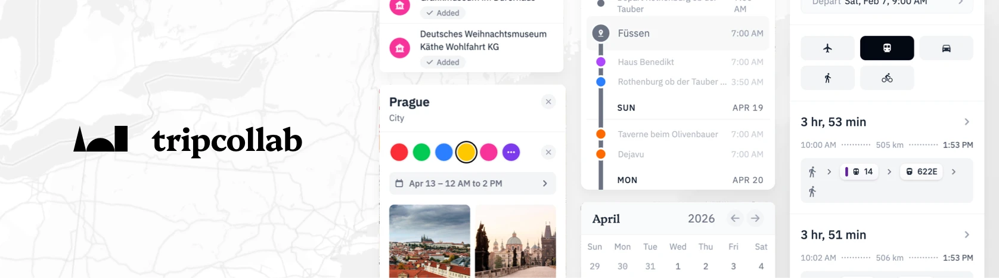
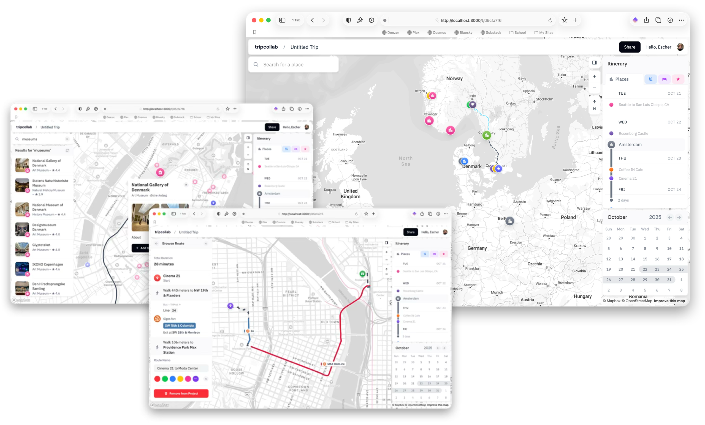

# tripcollab

 

A Collaborative Spatial and Temporal Platform for Visualizing Complex Travel Itineraries.

## Introduction

The purpose of this project is to develop an online platform for visualizing complex travel itineraries, combining spacial interfaces through the use of maps and temporal interfaces through the use of timelines and calendars. Through thoughtful experience design, iterative user-testing, and integrated collaboration features, the outcome of this project will be a user-friendly platform that addresses the challenges of group travel planning.

## Features

- Easy itinerary sharing
  - Customizable editing/viewing permissions
  - Public link sharing
- Explore points of interest on an interactive globe 
  - Images, reviews, and info panels from [Apple Maps](https://maps.apple.com/)
  - Integrated, context-aware search features
- Visualize journeys with real-world route planning features
  - Detailed routing information from [HERE](https://www.here.com/)
  - Public transit, driving, walking, biking, and flying routes supported
- Deeply integrated scheduling features
  - See travel plans day-by-day, organized by category
- Modern, user-friendly UI


## Demo



A live demonstration of the trip-planning interface is [available here](https://wip.tripcollab.app/t/88455d5d). Account creation is currently invite-only.

## Road Map

Coming Soon...


## Running Locally

You will need the following environment variables:

- `DATABASE_URL` _(Postgres database endpoint)_
- `MAPBOX_ACCESS_TOKEN`
- `NEXT_PUBLIC_MAPBOX_ACCESS_TOKEN`
- `NEXT_PUBLIC_MAPBOX_SESSION_TOKEN`
- `HERE_PLATFORM_APP_ID`
- `HERE_PLATFORM_API_KEY`
- `WORKOS_API_KEY`
- `WORKOS_CLIENT_ID`
- `WORKOS_COOKIE_PASSWORD`

To run the development server:

```bash
npm run dev
# or
yarn dev
# or
pnpm dev
```

Open [http://localhost:3000](http://localhost:3000) with your browser to see the result.


## Learn More

For more information about this project check out my undergraduate thesis document, [available on the OSU ScholarsArchive](https://ir.library.oregonstate.edu/concern/honors_college_theses/s7526n176?locale=en).

## License

This project is licensed under an MIT License - see the [LICENSE](LICENSE) file for details.

